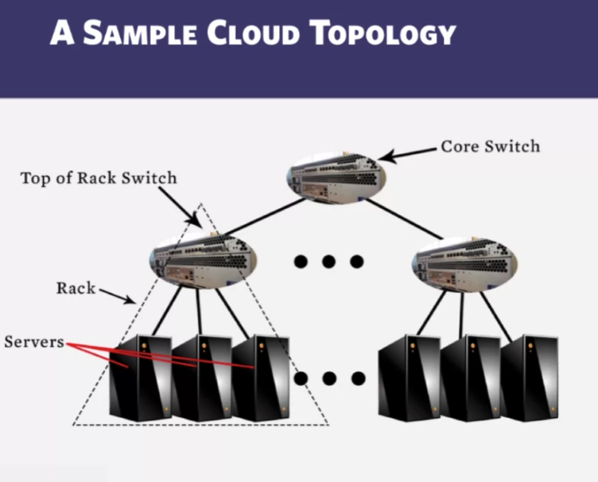

# Refresh concepts
* Process = A program in action

# Key Phrases/Concepts
Keep your eyes open for the following key terms or phrases as you  complete the readings and interact with the lectures. These topics will  help you better understand the content in this module.

* Clouds
  * Cloud = lots of storage + compute cycles nearby 
  * A single-site cloud (datacenter)
    * **Compute nodes** (grouped into racks, a rack as a unit of several servers which typically share the same power and often share a top of the rack **switch**.)
    * A **network topology** (e.g. hierarchical)
    * (Storage)**back-end** nodes connected to the network
    * **Front-end** for submitting jobs and receiving client requests (includes operating systems that includes a user level applications - IP, the switches, routers, other routing protocol)
  * Geo-distributed (geographically distributed cloud)
    * multiple sites, each sitte being the datacenter
    * Each site perhaps with a different structure and services.
  * 
* MapReduce paradigm
* [Hadoop YARN](http://hadoop.apache.org/)
* The key differences between cloud computing and previous generations of distributed systems.
* Design MapReduce programs for a variety of problems.
* How Hadoop schedules jobs.
